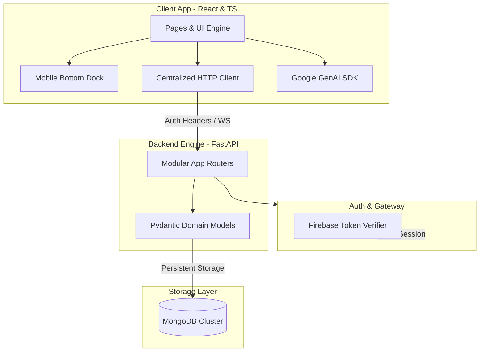

# 🔄 SkillSwap

A peer-to-peer skill exchange platform where users can teach what they know and learn what they don't. Built as a full-stack, multi-module social learning system featuring an embedded AI mentor, interactive token economy, and real-time collaboration environments.

<div align="center">

[](https://skillswap.sujalsule.in)
[](https://github.com/Sujal-Sule/SkillSwap-Minor-Project)

</div>

---

## 📐 System Architecture

SkillSwap uses an environment-aware, decoupled layout matching a high-performance React client with an asynchronous FastAPI processing layer.

### Architectural Data Flow


### 1. Frontend

**React + TypeScript + Vite.**

* `services/api.ts` — base URL config, auth headers, request dedup, cache invalidation.
* Covers user workspaces, discovery, real-time layouts, and legal/helper pages.

### 2. Backend

**FastAPI (Python).**

* Env-aware CORS for local, LAN (mobile debug), and production.
* `backend/dependencies.py` — Firebase bearer token auth.

---

## ⚡ Core Feature Modules

* **AI Mentor** (`pages/CoachPage.tsx`, `services/geminiService.ts`) — Google GenAI SDK, per-user chat context, delivers learning plans and roadmaps.
* **Token Economy** (`TokenTransaction`) — earn credits by teaching, spend credits to book sessions.
* **Sessions** — match (`teaches` vs `learns`) → connect → schedule (time/duration/cost) → review & settle tokens.
* **Chat Engine** — text, inline cards, and live AI guidance.
* **Shared Canvas** — real-time collaborative whiteboard.
* **Notifications** — matches, session updates, invites.
* **Admin Router** — platform metrics, suspend/promote users (`isSuspended`, `isAdmin`).

---

## 🛠️ Technical Specifications & Setup

### Tech Stack

* **Frontend UI:** React, TypeScript, Vite, React Router, Framer Motion, Google GenAI SDK
* **Backend API:** FastAPI, Python, MongoDB, Firebase Auth Services, WebSockets, Pydantic

### System Environment Variables

**Frontend (`.env`):**

```env
VITE_API_URL=http://localhost:8000
VITE_API_KEY=your_gemini_api_key
```

**Backend (`backend/.env`):**

```env
FRONTEND_URL=http://localhost:5173
MONGODB_URL=your_mongodb_connection_string
```

### Local Development Bootstrapping

```bash
# 1. Clone and launch the Frontend Single Page Application
git clone https://github.com/Sujal-Sule/SkillSwap-Minor-Project.git
npm install
npm run dev

# 2. Open an alternative shell and spin up the API gateway
cd backend
pip install -r requirements.txt
uvicorn main:app --reload
```
